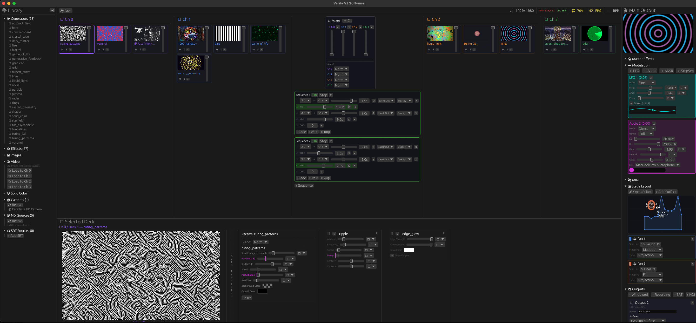

# Varda

Open-source visual performance instrument with broadcast-style routing for VJs and installation artists. Linux and macOS.



## What it does

Varda applies broadcast video workflows to live visuals. Sources (video, cameras, generative shaders, NDI streams, SRT feeds, images) flow through a routing graph of decks, channels, and surfaces to reach outputs (projectors, streams, recordings). There is no clip grid or trigger button. Sources are always available in the routing graph; you mix between them with opacity, blend modes, crossfaders, and effect chains. Zero-opacity decks and channels are automatically culled from the render pass, the same way a broadcast switcher only processes sources that are live on a bus.

- **Routing matrix**: Sources > Decks > Channels > Mixer > Surfaces > Outputs. Any source to any output, split, branch, or sub-mix at every junction
- **Sources**: video (HAP GPU-native + ffmpeg), cameras, ISF shaders (generators/filters), NDI, SRT, images, solid color
- **Mixing**: N-channel compositing, A/B crossfader, per-deck opacity, 6 blend modes
- **Transitions**: ISF shader transitions between channels, deck auto-transitions (timer/clip-end triggers), multi-channel transition sequencer
- **Effect chains**: 3-level hierarchy (deck > channel > master), drag-and-drop from library, reorderable
- **Modulation**: LFO, audio-reactive, ADSR, step sequencer, mod-on-mod chaining on any parameter
- **Audio**: 512-bin FFT, beat detection, bass/mid/treble bands, BPM with beat phase
- **Control**: MIDI (multi-device, learn mode, controller profiles, LED feedback), OSC in/out
- **Projection mapping**: 2D stage editor, polygon/circle surfaces, per-surface corner-pin warp, calibration cards
- **Multi-output**: multiple windows, fullscreen on any display, headless outputs with surface assignments
- **Network I/O**: NDI send/receive, SRT stream/receive, source library with drag-to-channel
- **Recording**: H.264, ProRes 422, HAP Q per-output
- **Persistence**: full scene/venue/MIDI state saved and restored across sessions

## Build & run

Requires Rust (stable) and a GPU with Metal (macOS) or Vulkan support.


### (Optional) Install ffmpeg with SRT support for SRT I/O
#### macOS
```bash
brew tap homebrew-ffmpeg/ffmpeg
brew install homebrew-ffmpeg/ffmpeg/ffmpeg --with-srt
```

### (Optional) Install NDI support for NDI I/O
#### macOS
```bash
brew install --cask libndi
```


### Run

```
cargo run
```

Varda treats the current working directory as a workspace. All state lives in a `.varda/` directory created automatically:

```
your-show/
  .varda/
    scene.json       # channels, decks, effects, modulation, crossfader, transition sequences
    stage.json       # surface layout, outputs, warp calibration
    midi.json        # MIDI controller mappings
  shaders/           # ISF shaders (scanned on startup)
```

Run `cargo run` from different directories to maintain separate workspaces per show, venue, or project. Each workspace has its own scene, stage layout, and MIDI mappings.


## Abstractions you should know about

Varda uses a routing graph model, similar to broadcast video routers, rather than a clip-trigger workflow. Sources are always present in the graph and available for mixing. There is no "launch" or "trigger" action. You mix by adjusting opacity, blend modes, and crossfader position. Decks and channels at zero opacity are automatically culled from the GPU render pass, so only sources that contribute to a live output cost render time.

A **Deck** is an independent render unit. It wraps a source (a shader, video, image, solid color, camera feed, NDI stream, or SRT stream) and has its own effect chain and parameters. Decks at zero opacity are culled from the render pass entirely.

Decks live inside **Channels**. A channel composites its decks together using per-deck opacity, blend modes, and optional auto-transitions. Channels also have their own effect chain applied after deck compositing.

Channels are composited into the **Main Channel** by the mixer. With two channels the mixer uses a crossfader; with three or more it uses per-channel opacity and blend modes. The main channel has its own effect chain, applied to the final composite after all channels are mixed.

**Surfaces** are optional. They define polygonal regions on a 2D stage canvas. Each surface has a content source (main, a channel, or a sub-mix of channels) and a content mapping (fill or UV-mapped). Surfaces are how you map content onto physical screens, LED panels, or projection areas. When no surfaces are defined, the full output receives the main channel directly.

**Outputs** define where rendered frames are sent: a window, a fullscreen display, an NDI stream, an SRT stream, or a recording. Surfaces are assigned to outputs to complete the routing chain.

The default/simple full signal path is: **Sources → Decks → Channels → (Main Channel) → Surfaces → Outputs**. At every junction you can branch, split, or re-route. Two channels feeding different surfaces on the same output. The main channel on one output, a single channel isolated on another. A sub-mix of specific channels to an NDI stream while the master goes to projection. This is a broadcast style routing matrix/graph model. 