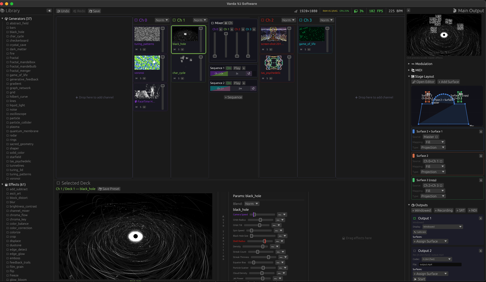

# Varda VJ

A visual performance tool with broadcast style routing for VJs, installation artists, and anyone who wants to throw pixels at things.




Varda applies broadcast video workflows to live visuals. Sources (video, cameras, generative shaders, streams, images) flow through a routing graph of decks, channels, and surfaces to reach outputs (projectors, streams, recordings). Instead of a clip-launch grid, you control what's live by adjusting opacity, blend modes, crossfaders, mute/solo, and effect chains. 

- **Routing matrix**: Sources > Decks > Channels > Mixer > Surfaces > Outputs. Any source to any output, split, branch, or sub-mix at every junction
- **Sources**: video (HAP GPU-native + ffmpeg), cameras, ISF shaders (generators/filters), NDI, SRT, HLS, DASH, RTMP/RTMPS, Syphon (macOS receive), images, and html/css/js sources (Servo)
- **Mixing**: N-channel compositing, A/B crossfader, per-deck opacity, 15 blend modes, linear-light HDR pipeline
- **Color**: 9 tonemap presets (ACES, AgX, Reinhard, Hable, etc.), 3D LUT support (.cube/.3dl) for color grading
- **Transitions**: ISF shader transitions between channels, deck auto-transitions (timer/clip-end triggers), multi-channel transition sequencer with beat-synced or timed triggers (seconds, minutes, hours). Allowing for quick automated live transitions or long running automated installations.
- **Effect chains**: 3-level hierarchy (deck > channel > master), drag-and-drop from library, reorderable
- **Modulation**: LFO, audio-reactive, ADSR, step sequencer, mod-on-mod chaining on any parameter
- **Analyzer preprocessors**: ML-powered analysis, sensor data interpretation, and more injected as shader data textures via ISF `PREPROCESSORS` declarations. CPU/GPU hybrid pipeline for effects that need structured data vanilla GLSL can't produce
- **Audio**: 2048-bin FFT, beat detection, bass/mid/treble bands, BPM with beat phase
- **Control**: MIDI, OSC, and HTTP API co-equal consumers of the same engine
- **Projection mapping**: 2D stage editor, polygon/circle surfaces, per-surface corner-pin warp, calibration cards, edge blending (Auto with precise polygon overlap detection, Manual per-edge)
- **Multi-output**: multiple windows, fullscreen on any display, headless outputs with surface assignments
- **Network I/O**: NDI, SRT, HLS, LL-HLS, DASH, and RTMP/RTMPS send/receive
- **Recording**: H.264, h.265, AV1, ProRes 422, HAP Q per-output
- **Presets**: save/load deck and channel presets with modulation recipes
- **Persistence**: full scene/venue/MIDI state saved and restored across sessions

Experimental:
- **Dome projection**: fisheye to equirectangular (360°) and cubemap (3D) rendering with configurable lens correction and chromatic aberration.
- **Surface overlap zones**: manual and auto-detect modes for precise edge blending.
- **Compute shader support**: ISF compute shaders for particle simulations, fluid dynamics, ect

## Install

Download the latest release from the [Releases page](https://github.com/im-knots/varda/releases).

### macOS (Universal DMG)

1. Download `Varda-macOS-universal.dmg`
2. Open the DMG and drag **Varda.app** to `/Applications`
3. Before first launch, open Terminal and run:
   ```bash
   xattr -cr /Applications/Varda.app
   ```
   This removes the macOS quarantine flag. Varda is not yet signed with an Apple Developer certificate, so Gatekeeper will block it without this step.
4. Launch Varda — on first run it will prompt for your password to install the `varda` CLI command to `/usr/local/bin/`

### Linux (Portable Tarball)

1. Download `Varda-Linux-x86_64.tar.gz`
2. Extract and run:
   ```bash
   tar xzf Varda-Linux-x86_64.tar.gz
   cd Varda-Linux-x86_64
   ./varda
   ```
   Put the folder anywhere — on a USB drive, in your home directory, wherever. FFmpeg and codec libs are bundled.

### Windows (Portable ZIP)

1. Download `Varda-Windows-x64.zip`
2. Extract the ZIP to any folder (e.g. `C:\Varda`)
3. Run `varda.exe`

No installer required. FFmpeg DLLs and shaders are bundled in the ZIP. NDI is included when available.

> **Note:** Windows may show a SmartScreen warning because the binary is not code-signed. Click **"More info"** then **"Run anyway"**. You may also need the [Visual C++ Redistributable](https://aka.ms/vs/17/release/vc_redist.x64.exe) if it's not already installed (most Windows 10/11 systems have it).

All releases bundle FFmpeg and NDI, no extra dependencies needed.

## Getting Started
See the [manual](docs/README.md) for a complete guide to using Varda.

---

## Build from source

For bleeding edge features and bug fixes you can compile Varda from source.

Requires [Rust](https://rustup.rs/) (stable) and a GPU with Metal (macOS) or Vulkan (Linux) support.

### Ubuntu / Debian

```bash
sudo apt install build-essential cmake pkg-config libvulkan-dev libavcodec-dev libavformat-dev libavutil-dev libswscale-dev libswresample-dev libavdevice-dev libsrt-gnutls-dev libasound2-dev libv4l-dev libshaderc-dev libwayland-dev libxkbcommon-dev libx11-dev libxrandr-dev libxi-dev libgtk-3-dev
```

```bash
cargo build --release
./target/release/varda
```

#### Optional: NDI
NDI is proprietary and not available via apt. To enable NDI send/receive:
```bash
wget https://downloads.ndi.tv/SDK/NDI_SDK_Linux/Install_NDI_SDK_v6_Linux.tar.gz
tar -xzf Install_NDI_SDK_v6_Linux.tar.gz
sudo ./Install_NDI_SDK_v6_Linux.sh
sudo cp -P NDI\ SDK\ for\ Linux/lib/x86_64-linux-gnu/* /usr/local/lib/
sudo ldconfig
```
Without it, NDI features are silently disabled

### macOS

```bash
# FFmpeg (with SRT support)
brew tap homebrew-ffmpeg/ffmpeg
brew install homebrew-ffmpeg/ffmpeg/ffmpeg --with-srt

# Optional: NDI
brew install --cask libndi
```

```bash
cargo build --release
./target/release/varda
```

### Run from source

```
cargo run --release
```


## CLI flags

```
varda [OPTIONS]

    --headless                Run without main UI window (API-only control)
    --port <PORT>             HTTP API port [default: 8080]
    --fps <FPS>               Target render FPS in headless mode [default: 60]
    --workspace <DIR>         Workspace root directory [default: cwd]
    --scene <PATH>            Scene file to load
    --stage <PATH>            Stage file to load
    --osc-port <PORT>         OSC input port (overrides osc.json)
    --osc-out <HOST:PORT>     OSC feedback target (repeatable)
    --no-osc                  Disable OSC
    --no-ndi                  Disable NDI
    --no-syphon               Disable Syphon (macOS)
    --shader-dir <DIR>        Extra shader library directory (repeatable)
```

`--shader-dir` is repeatable and layers on top of the built-in shader directories in a fixed precedence order. see [ISF Shader Authoring → File Location](docs/12-isf-authoring.md#file-location) for the full hierarchy and override/hot-reload behavior.

Headless mode runs the full engine without a UI window — controlled via the HTTP API. Outputs defined in `stage.json` auto-start on launch. Graceful shutdown on Ctrl-C or `POST /api/shutdown`.

```bash
# Headless on custom port with 30fps render
varda --headless --port 9090 --fps 30

# Separate workspace per venue
varda --workspace /shows/festival-2026

# Disable subsystems you don't need
varda --no-ndi --no-syphon --osc-port 7000

# Pull in extra shader folders (repeatable) — e.g. a USB stick + a show pack
varda --shader-dir /media/usb/shaders --shader-dir /shows/festival-2026/shaders
```

## HTTP API

The GUI and HTTP API are co-equal consumers of the same engine. The API runs on port 8080 (configurable with `--port`) alongside the GUI, or standalone in headless mode (`--headless`). Interactive docs at `/api/docs`, OpenAPI spec at `/api/openapi.json`. WebSocket at `/api/ws` streams state via JSON Patch (RFC 6902) deltas.


## Contributing

Bug reports, feature requests, and pull requests are welcome. See [CONTRIBUTING.md](CONTRIBUTING.md) for the architecture overview, engineering practices, PR workflow, and [benchmarking harness](CONTRIBUTING.md#benchmarking).

## License
[MIT](LICENSE)