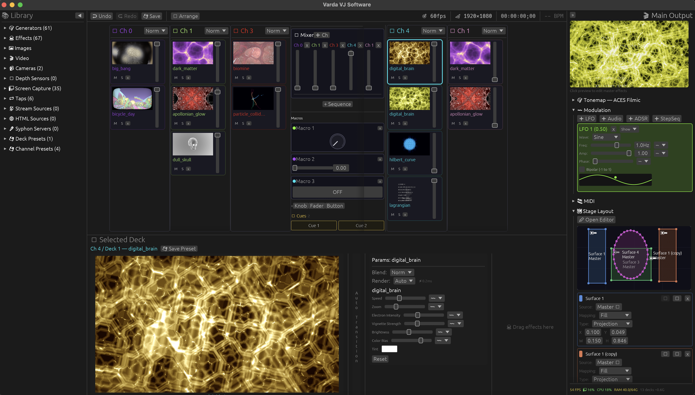

# Getting Started

## Install

Download the latest release from the [Releases page](https://github.com/im-knots/varda/releases). All releases bundle FFmpeg and NDI.

### macOS (Universal DMG)

1. Download `Varda-macOS-universal.dmg`
2. Open the DMG and drag **Varda.app** to `/Applications`
3. Before first launch, open Terminal and run:
   ```bash
   xattr -cr /Applications/Varda.app
   ```
   This removes the macOS quarantine flag. Varda is not yet signed with an Apple Developer certificate, so Gatekeeper blocks it without this step.
4. Launch Varda. On first run it asks for your password to install the `varda` CLI command to `/usr/local/bin/`

### Linux (Flatpak or AppImage)

#### Flatpak

```bash
flatpak install --user Varda-<version>-x86_64.flatpak
flatpak run io.github.im_knots.varda
```

If you have not used Flatpak on this machine before, add the remote first:

```bash
flatpak remote-add --if-not-exists --user flathub https://dl.flathub.org/repo/flathub.flatpakrepo
```

#### AppImage

```bash
chmod +x Varda-<version>-x86_64.AppImage
./Varda-<version>-x86_64.AppImage
```

#### Adding a `varda` command

To get a `varda` command on your `$PATH`, alias the AppImage, or for the Flatpak:

```bash
alias varda='flatpak run io.github.im_knots.varda'
```

### Windows (Portable ZIP)

1. Download `Varda-Windows-x64.zip`
2. Extract the ZIP to any folder (e.g. `C:\Varda`)
3. Run `varda.exe`

There is no installer. The ZIP includes the FFmpeg DLLs and shaders.

> **Note:** Windows may show a SmartScreen warning because the binary is not code-signed. Click **"More info"**, then **"Run anyway"**. You may also need to install the [Visual C++ Redistributable](https://aka.ms/vs/17/release/vc_redist.x64.exe). Most Windows 10/11 systems already have it.

## Build from Source

Requires [Rust](https://rustup.rs/) (stable) and a GPU with Metal (macOS), Vulkan (Linux), or DirectX 12 (Windows) support.

### Ubuntu / Debian

```bash
sudo apt install build-essential cmake pkg-config libvulkan-dev libavcodec-dev libavformat-dev libavutil-dev libswscale-dev libswresample-dev libsrt-gnutls-dev libasound2-dev libv4l-dev libfreenect-dev libpipewire-0.3-dev libwayland-dev libxkbcommon-dev libx11-dev libxrandr-dev libxi-dev libgtk-3-dev
```

Two of these packages are needed by features that are on by default. If either is
missing, the build fails:

- `libpipewire-0.3-dev`: the `screen-capture` Wayland backend finds it through `pkg-config`.
- `libfreenect-dev`: provides the `-lfreenect` library the `depth` feature links against.

Both are in Ubuntu's `universe` component. If `apt` cannot find them, run
`sudo add-apt-repository universe` first.

```bash
cargo build --release
./target/release/varda
```

### Fedora / Nobara

```bash
sudo dnf install gcc-c++ cmake pkgconf-pkg-config vulkan-loader-devel ffmpeg-devel srt-devel alsa-lib-devel libv4l-devel libfreenect-devel pipewire-devel wayland-devel libxkbcommon-devel libX11-devel libXrandr-devel libXi-devel gtk3-devel
```

`ffmpeg-devel` comes from RPM Fusion, which Fedora does not enable by default:

```bash
sudo dnf install https://mirrors.rpmfusion.org/free/fedora/rpmfusion-free-release-$(rpm -E %fedora).noarch.rpm
```

### Arch / CachyOS / Manjaro

```bash
sudo pacman -S --needed base-devel cmake pkgconf vulkan-icd-loader ffmpeg srt alsa-lib v4l-utils libusb pipewire wayland libxkbcommon libx11 libxrandr libxi gtk3
```

`libfreenect` (Kinect v1 depth sensors) is not in any Arch repository. Install it from
the AUR (`yay -S libfreenect`) before building, or build without that feature:

```bash
cargo build --release --no-default-features --features face-detection,html,screen-capture
```

### openSUSE

```bash
sudo zypper install -t pattern devel_C_C++ && sudo zypper install cmake pkgconf vulkan-devel ffmpeg-7-libavcodec-devel ffmpeg-7-libavformat-devel srt-devel alsa-devel libv4l-devel pipewire-devel wayland-devel libxkbcommon-devel libX11-devel libXrandr-devel libXi-devel gtk3-devel
```

openSUSE's FFmpeg is in the Packman repository. `libfreenect` is not packaged. If you do
not need Kinect v1 support, build with `--no-default-features` and every default feature
except `depth`.

### macOS

```bash
brew tap homebrew-ffmpeg/ffmpeg
brew install homebrew-ffmpeg/ffmpeg/ffmpeg --with-srt

# Depth-sensor support (the default-on `depth` feature)
brew install libfreenect
```

```bash
# Homebrew's lib directory is not on the linker's default search path, and
# libfreenect's crate does not emit one. Without this the build fails at link
# time with: ld: library 'freenect' not found
export LIBRARY_PATH=/opt/homebrew/lib      # Apple Silicon
# export LIBRARY_PATH=/usr/local/lib       # Intel

cargo build --release
./target/release/varda
```

Use `LIBRARY_PATH`, not `-L` in `RUSTFLAGS`. Changing `RUSTFLAGS` invalidates the whole
build cache, and a full rebuild of this project takes a long time.

To build without depth-sensor support, leave out the `depth` feature:

```bash
cargo build --release --no-default-features --features face-detection,html,screen-capture
```

### Run from source

```sh
cargo run --release
```

## Workspace & Content

Varda uses the current directory as the workspace root, or the path given with `--workspace`. Create a project folder and put your content in it:

```
my-show/
  shaders/       ← ISF shader files (.fs) — auto-discovered, hot-reloaded on save
  media/         ← videos and images (loaded via Library panel)
  .varda/        ← created automatically (scene, stage, presets, mappings, OSC config)
```

Shaders in `shaders/` appear in the Library panel under **Generators**, **Effects** or **Transitions**, depending on their type. Load videos and images through the Library panel's file browser.

**Supported formats:**

| Type | Formats |
|------|---------|
| **Shaders** | `.fs`, `.comp`  (ISF GLSL 450 fragment and compute) |
| **Video** | Any container and codec ffmpeg supports: MP4, MOV, MKV, AVI, WebM (H.264, H.265, ProRes, VP9, etc.) |
| **HAP Video** | MOV with HAP, HAP Alpha, HAP Q, HAP Q Alpha, HAP R. Decoded on the GPU, with no CPU decode cost |
| **Images** | PNG, JPG/JPEG, BMP, TIFF, TGA, WebP |
| **Vector** | SVG/SVGZ. Redrawn at your render resolution, so it stays sharp at any size |

This table covers local files. Varda also takes live and network inputs such as cameras, NDI, SRT, HLS, DASH, RTMP, screen and window captures, and compute shaders. See [Source Types](02-concepts.md#source-types) for the complete list.

## UI Layout



- **Top bar:** undo, redo and save on the left. On the right, from the right edge inward: the **BPM / clock** readout, the **transport position** as timecode, the **📐 render resolution** and the **🎯 target frame rate**. Click any of them to open its settings.
- **Library** (left, toggle with **L**): the content browser for shaders, video, images, cameras, screen capture targets, taps, NDI, SRT, HLS/DASH sources and presets. See [Library Panel](03-library-panel.md).
- **Center:** the channel and deck grid, with the mixer crossfader. Switch to **Stage Editor** to draw surfaces.
- **Right:** the main output preview at the top, then collapsible sections: **🎨 Tonemap** (curve and 3D LUT), **〰 Modulation**, **🎹 MIDI**, **🗺 Stage Layout** and **📺 Outputs**. Live performance metrics (frame rate, GPU, CPU, RAM) are at the bottom.
- **Bottom** (resizable): shows the selected deck's parameters, effect chains or sequence editor, depending on what is selected.

Drag any panel divider to resize. You can collapse the left and right panels. When the right panel is collapsed, the performance metrics stay visible, stacked in the narrow strip that remains.

## Load Content

1. Open the **Library** panel (press **L** to toggle)
2. Browse the **Generators** section for ISF shaders
3. **Drag** a shader from the library into a channel column. This creates a new deck.

The shader shows right away in the deck's preview thumbnail and in the main output.

To load **video or images**, use the Video or Image sections in the Library. A file browser opens so you can pick files from your workspace.

## Add a Second Channel

1. Drag another shader into the second channel column
2. Use the **crossfader** in the mixer box to blend between Channel A and Channel B
3. Click the **auto-transition** button for timed or beat-synced crossfades
4. Select a **transition shader** (dissolve, iris, push, etc.) from the dropdown

## Apply Effects

1. In the library, switch to the **Effects** section
2. Drag an effect onto a deck, channel, or the master output
3. Select the deck or effect to see its parameters in the **bottom bar**
4. Adjust parameters with the sliders. You can map any of them to MIDI or OSC, and modulate any of them

## Output to a Display

1. In the right panel, open the **📺 Outputs** section and choose **+ Output → Display**. The output's card appears; nothing opens yet.
2. Pick the projector or display from the card's **Monitor** dropdown. The output goes fullscreen on it.

To use a floating window instead, choose **+ Output → Window**.

For rotation, source routing, and multi-output recording, see [Outputs](07-outputs.md).

## Audio Reactivity

Varda analyzes audio input to detect beats and to drive frequency-band modulation. To set it up:

1. In the **modulation panel** (right sidebar), add an **Audio** modulation source
2. In the source's **device dropdown**, select the audio input receiving your music feed (line-in, USB interface, etc.)
3. Choose a **frequency preset** (Low for bass, Mid, or High for treble), or set a custom Hz range
4. Assign the source to any parameter (opacity, a shader parameter, etc.). The parameter now follows the music.

Beat detection starts on its own from the audio input. The BPM appears in the top bar and drives beat-synced transitions and auto-crossfades.

ISF shaders also get audio data directly through built-in uniforms (`audio_bass`, `audio_mid`, `audio_treble`, `audio_bpm`, `audio_beat_phase`), with no modulation setup. See [Modulation & Audio Reactivity](05-modulation.md) for the full guide.

## Next Steps

Once you have content playing on a display, see:

- **[Performance & Automation](04-performance.md)**: video playback controls, deck auto-transitions, transition sequences, undo/redo, presets
- **[Modulation & Audio Reactivity](05-modulation.md)**: LFO, audio bands, ADSR, step sequencer, mod-on-mod chaining
- **[Control Surfaces](06-control-surfaces.md)**: MIDI learn, OSC, keyboard shortcuts, clock sync
- **[Projection Mapping](08-projection.md)**: surfaces, corner-pin warp, multi-projector edge blending, dome projection
- **[Outputs](07-outputs.md)**: display targets, rotation, source routing, multi-output recording
- **[Streaming & I/O](09-streaming-and-io.md)**: NDI, SRT, HLS/DASH, recording
- **[ISF Shader Authoring](12-isf-authoring.md)**: write your own generators, filters and transitions
- **[HTTP API](13-api.md)**: REST/WebSocket control, headless mode

## Save Your Work

Press **Cmd+S** or click **💾 Save** to save the current state. Varda saves:

| File | Contents |
|------|----------|
| `scene.json` | Your show (channels, decks, effects, modulation) |
| `stage.json` | The venue (surfaces, outputs, warp calibration) |
| `midi.json` | Controller mappings |
| `keymap.json` | Keyboard shortcuts |

## CLI Flags

```
varda [OPTIONS]

    --headless              Run without UI window (API-only control)
    --port <PORT>           HTTP API port (default: 8080)
    --fps <FPS>             Target render FPS in headless mode (default: 60)
    --workspace <DIR>       Workspace root directory (default: current directory)
    --scene <PATH>          Scene file to load (default: .varda/scene.json)
    --stage <PATH>          Stage file to load (default: .varda/stage.json)
    --osc-port <PORT>       OSC input port (overrides osc.json config)
    --osc-out <HOST:PORT>   OSC feedback target (repeatable)
    --no-osc                Disable OSC input
    --no-ndi                Disable NDI discovery and sending
    --no-syphon             Disable Syphon (macOS only)
    --no-spout              Disable Spout (Windows only)
    --no-html               Disable HTML deck sources (skips Servo rendering)
    --no-screen-capture     Disable screen / window capture deck sources
                            (no Screen Recording permission is ever requested)
```

CLI flags override the saved config for that session only. They do not change the saved files.

---

[Home](README.md) · [Next: Core Concepts →](02-concepts.md)
